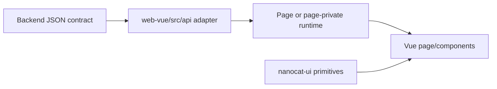

# Frontend Map

Status: current

The Vue application owns transport validation, interaction state, layout, and
rendering. Business meaning arrives through backend projections.

## Route ownership

The route source is
[`../../web-vue/src/router/routes.ts`](../../web-vue/src/router/routes.ts).

| Route | Page owner | Principal page-private runtime/adapters |
| --- | --- | --- |
| `/login` | `Login.vue` | Auth adapter and redirect validation |
| `/` | `Dashboard.vue` | `dashboard/useDashboardPage.ts`, `statsApi` |
| `/accounts` | `Accounts.vue` | `accounts/useAccountsPage.ts`, account CRUD, selection, import, bulk-operation, and test runtimes |
| `/settings` | `Settings.vue` | Settings configuration, integrations, Prompt Sources, User Keys, backup, and external-source runtimes |
| `/proxy` | `Proxy.vue` | Default-proxy, group, and node-import runtimes; `proxyApi` |
| `/logs` | `Logs.vue` | Query, selection, export, and detail runtimes; `logsApi` |
| `/monitor` | `Monitor.vue` | Realtime list and detail runtimes; `monitorApi` |
| `/gallery` | `Gallery.vue` | Query, interaction, and operation runtimes; `galleryApi` |
| `/studio` | `Studio.vue` | Send, chat stream, image/file task, polling, conversation, prompt, model, layout, and scroll runtimes |
| `/debug` | Redirect only | Redirects to `/studio`; it is not a separate page |

`AppShell.vue` owns authenticated product navigation and header-level overlays.
Each page owns its responsive composition and has one explicit scroll owner per
scrolling region.

## Data path

- `web-vue/src/api/` owns HTTP transport, request types, response validation,
  and protocol normalization.
- Page-private runtimes own drafts, selection, polling, retained snapshots,
  loading/error state, overlay state, and orchestration for one page.
- Vue components render final backend semantics and page state. They may format
  pure visual values, but cannot infer backend status, capability, or next
  action from raw error strings or parallel flags.

## UI ownership boundary

| Belongs to `nanocat-ui` | Belongs to this repository |
| --- | --- |
| Tokens, controls, menus, generic overlays, focus behavior, theme state, and reusable dock/modal primitives | AppShell, routes, product copy, tables, charts, domain timelines, page workflows, and product-specific responsive layout |

A visual Module moves to Nanocat only after more than one real consumer or a
concrete cross-project use case exists. Page-specific code stays next to the
page while it has one owner. The Nanocat source is an independent repository
and is tested, committed, and released separately.

## Lifecycle rules

- Initial load, background refresh with a retained snapshot, true empty state,
  and error state are distinct.
- Entering a page may fetch immediately; refresh timers have one owner and are
  disposed with that owner.
- Closing an overlay returns focus according to the shared overlay contract and
  clears trigger states; pages do not add a competing focus lifecycle.
- A container that owns scrolling must have a bounded size in fixed-layout mode.
  In natural-height mode, document scrolling is the owner and nested regions do
  not claim the same axis.
- Single-item and batch actions call the same bulk Interface with one ID when
  their business semantics are identical.

See [`../control-panel-data-contract.md`](../control-panel-data-contract.md) for
projection consumption rules and [`critical-flows.md`](critical-flows.md) for
cross-layer sequences.
