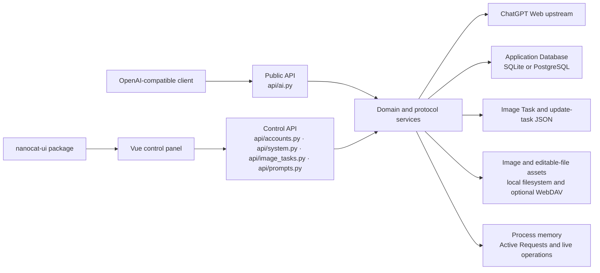

# System Map

Status: current

This map describes the current system boundaries. Domain terms and ownership are
defined by [`../../CONTEXT.md`](../../CONTEXT.md); this document only maps those
terms to the current code.

## Runtime context

[`../../api/app.py`](../../api/app.py) assembles the backend routers. The Vue
router in [`../../web-vue/src/router/routes.ts`](../../web-vue/src/router/routes.ts)
assembles the browser routes.

## Authority boundaries

| Concern | Authoritative owner | Consumers |
| --- | --- | --- |
| Domain language and relationships | [`../../CONTEXT.md`](../../CONTEXT.md) | Backend, frontend, current docs, and PRDs |
| Business state, capability, diagnostics, and action results | Backend domain services and projection services | API contracts and Vue adapters |
| Public request/response shape | FastAPI contracts under `api/` | External clients and `web-vue/src/api/` |
| Drafts, selection, loading, overlays, layout, and scrolling | The owning Vue page or page-private runtime | Page components |
| Generic controls, overlays, tokens, and interaction primitives | `nanocat-ui` | Vue product pages |
| Product navigation, charts, workflows, and responsive composition | `chatgpt2api/web-vue` | Control-panel users |

The backend does not own browser layout, and the frontend does not reconstruct
backend business meaning from raw fields or error text.

## Persistence boundaries

| State | Current store | Owner |
| --- | --- | --- |
| Upstream Accounts and User Keys | Application Database | Account Repository through `DatabaseStorageBackend` |
| Settings, Proxy Groups, Account Groups, remote-import configuration, Call Records, dashboard aggregates, Prompt Library snapshots, coordination state, and Editable File Tasks | Separate repositories in the Application Database | Their domain services and repository interfaces |
| Image Tasks | `data/image_tasks.json` | `ImageTaskService` |
| Image Assets and gallery catalogue | Local files and optional WebDAV plus `data/image_index.json` | `ImageStorageService` |
| Editable File Assets | Published and staging filesystem directories | `EditableFileTaskService` |
| Active Requests and live operation counters | Process memory | `RealtimeMonitorService` |
| Online-update task progress | `data/update_task.json` | `UpdateService` |
| Studio conversation presentation state | Browser-local storage | Studio conversation runtimes |

One physical Application Database does not create one generic repository or one
transaction boundary. Image Assets, Image Tasks, gallery files, and live
monitoring remain outside it, as accepted by
[`../adr/0004-use-one-application-database-with-domain-repositories.md`](../adr/0004-use-one-application-database-with-domain-repositories.md).

## Detailed maps

- [`backend-map.md`](backend-map.md): router, service, repository, and projection ownership
- [`frontend-map.md`](frontend-map.md): routes, page runtimes, API adapters, and UI boundaries
- [`critical-flows.md`](critical-flows.md): account import, image tasks, observability, dashboard, and online update
